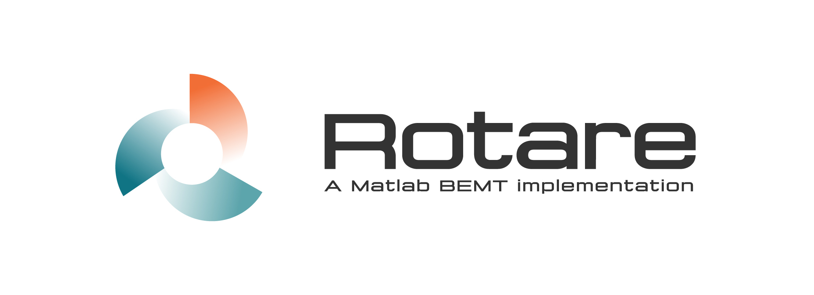

**Rotare** is a feature-rich and open-source implementation of the Blade Element
Momentum Theory in MATLAB.

This software can be used for the analysis and the design of all kinds of
rotors: helicopters main/tail rotors, aircraft propellers, wind/tidal turbines,
etc.

Rotare was developed primarily for teaching purposes at the [University of
Liege][uliege-am] (Belgium) by Thomas Lambert during his Ph.D. The code was
later extended to add different solvers, many extensions to the base methodology
and to support more complex geometries. It is now a complete analysis tool that
can be used in a wide range of applications outside of academia.

<div align="center">
  {- WARNING: The code is not yet fully validated. Use with caution. -}
</div>

## Features

A more exhaustive list of features can be found in [the complete
documentation][rotare-doc].

### Geometry

- [x] Varying airfoil along the blade
- [x] Custom twist/taper
- [ ] Coaxial rotors

### Flow

- [x] Steady/Hover
- [x] Axial flow
- [ ] Oblique flow (single rotor only)

### Extensions/corrections

- [x] Tip/Hub losses
- [ ] Compressibility
- [ ] Tip relief
- [ ] Spinner effects

### Solvers

Rotare implements 4 different solvers. Each one solves a different form of the
BEMT equations. Note that some of these solvers use additional hypotheses and
may not provide valid results in all situations.

## Installation and utilization

### Download and install

### Using git

To download the latest working version of Rotare, simply run

```bash
git clone --recursive https://gitlab.uliege.be/thlamb/rotare
```

Keep it updated using `git pull --recurse-submodules`.

### Direct download

If you do not use `git`, the best way to obtain a working version of rotare is
to download the latest stable version from the [release page][rotare-releases].

_Note_: Rotare uses dependencies which are not directly hosted in this
repository. Do not just downloading Rotare's repo this will not be enough!

A special archive is available for each release in the the release page under
the name `COMPLETE CODE`. This archive contains all the dependencies needed for
the proper use of Rotare. Always download this one and not the automatically
generated _source code_ archives.

## Documentation

Rotare comes with a [very detailed documentation][rotare-doc]. The documentation
is made of two parts:

1. The user manual
2. The technical documentation

The _user manual_ focuses on the practical aspects of the software, such as
requirements, installation, usage, etc. The _technical documentation_ provides a
full description of the code architecture, details regarding the methodology,
the solvers implementations, etc.

Every Rotare function comes with an extended help. This help can be printed in
the command window by executing `help <functionName>`.

## Issues and troubleshooting

If you encounter some issue while using this code, please read carefully the
error message. The user configuration file is validated with a custom function
to ensure that the inputs are correct. If the error is due to incorrect user
input, a meaningful error message is outputted to help you fix your
configuration.

If the error has nothing to do with your configuration, please check first the
troubleshooting section of [the documentation][rotare-doc].

If you encounter any other issue with this code, please check [the issue
tracker][rotare-issues] and fill a new issue report if applicable. You can also
contact me directly at tlambert@uliege.be.

## Other

This software will be presented at the [AIAA SciTech 2023 forum][aiaa-scitech]
in National Harbor, MD (USA). A link to the conference proceeding and the slides
of the presentation will be provided after the talk.

### Acknowledgments

We would like to thank Theo Delvaux for his initial implementation of the
oblique flight with the `indfact` solver. We would also like to thank Johan Le
for his work on the implementation of coaxial rotors during his master thesis.

Their excellent contributions facilitated considerably the final implementation
of these features in Rotare.

## Contributions

Any contribution or feature-request is welcomed. Feel free to use the [issue
tracker][rotare-issues] if you want to discuss interesting additions to this
software.

## License

The Rotare Software is provided under the [MIT license](LICENSE).

[uliege-am]: https://www.am.uliege.be/
[rotare-doc]: https://gitlab.uliege.be/thlamb/rotare-doc/
[rotare-issues]: https://gitlab.uliege.be/thlamb/rotare/issues
[rotare-releases]: https://gitlab.uliege.be/thlamb/rotare/-/releases
[aiaa-scitech]: https://www.aiaa.org/SciTech
